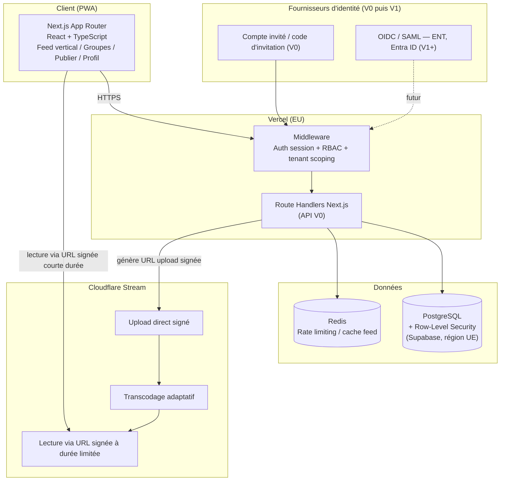
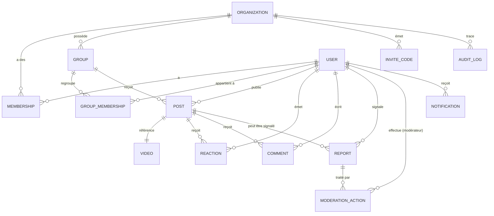
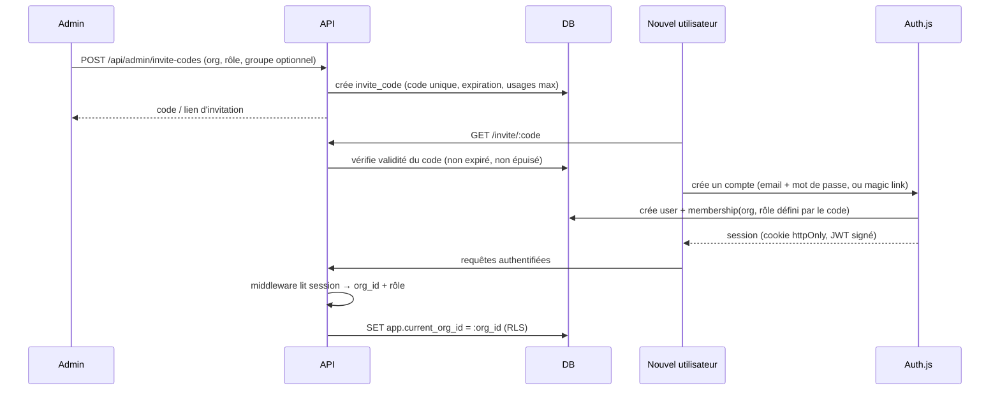
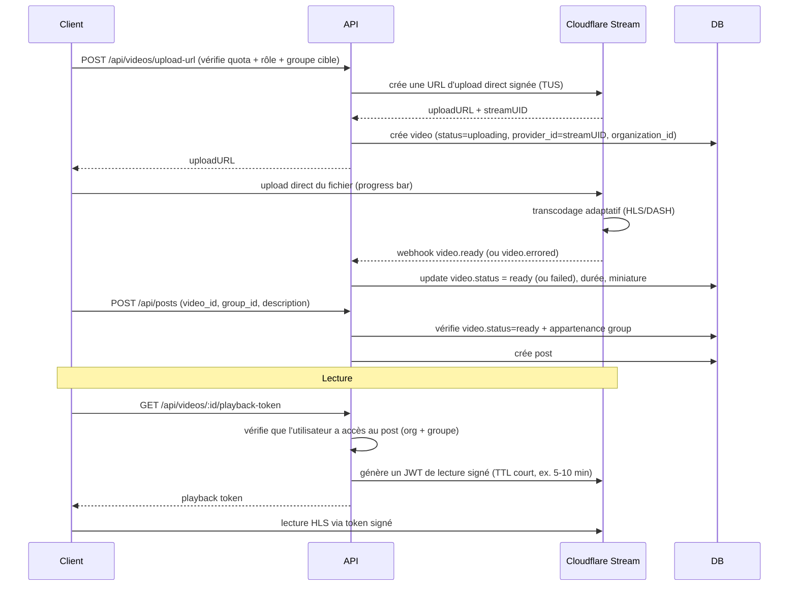

# Architecture V0 — Réseau vidéo privé de lycée

Statut : proposition de conception, **avant implémentation**.
Portée : pilote 20–50 élèves + personnel, 4–6 semaines, un seul
établissement au départ mais architecture multi-tenant dès le départ.

---

## 1. Architecture technique recommandée

### 1.1 Vue d'ensemble

- **Frontend + Backend** : un seul monorepo **Next.js (App Router,
  TypeScript)**, déployé comme PWA responsive. Les routes API Next.js
  (`app/api/*` ou route handlers) servent de backend V0.
  - *Compromis* : fusionner front/back accélère fortement le
    développement solo et réduit le nombre de services à sécuriser et
    déployer. On isole quand même la logique métier dans des modules
    `server/*` indépendants du framework HTTP, pour pouvoir extraire une
    API séparée plus tard (ex. si une app mobile native ou un partenaire
    ENT a besoin d'un accès API dédié) sans tout réécrire.

- **Base de données** : **PostgreSQL managé**, avec **Row-Level Security
  (RLS)** activée pour l'isolation multi-tenant (voir §4).
  - Recommandation V0 : **Supabase (région UE — Francfort)** pour
    Auth + Postgres + Storage (pièces jointes légères, pas la vidéo) +
    RLS native. Accélère fortement le développement (auth prête,
    policies RLS déclaratives, dashboard SQL).
  - *Compromis* : dépendance à Supabase (vendor lock-in partiel). Comme
    c'est du Postgres standard + RLS standard, une migration vers un
    Postgres managé « nu » (Neon, RDS, Scaleway) reste possible sans
    réécrire le schéma. À trancher avec le DPO si l'hébergement doit
    rester strictement en France plutôt qu'UE au sens large.

- **Vidéo** : fournisseur spécialisé, **Cloudflare Stream**
  recommandé (vs Mux).
  - *Compromis* : Cloudflare Stream propose nativement des URLs de
    lecture signées à durée limitée et des restrictions par referer/IP,
    ce qui correspond exactement à l'exigence « pas d'URL publique
    permanente ». Mux est équivalent fonctionnellement mais plus cher au
    stade pilote. À reconfirmer selon les tarifs au moment de
    l'implémentation.

- **Hébergement applicatif** : **Vercel (région UE)** pour le
  Next.js, ou alternative self-hosted (Docker sur Scaleway/OVH) si la
  souveraineté des données est un critère strict du DPO.
  - *Compromis* : Vercel = zéro ops, déploiement instantané, mais données
    de requêtes transitant par une plateforme US (même en région EU pour
    le compute). Pour un pilote interne sans données de santé/sensibles
    au sens RGPD strict, c'est un compromis raisonnable ; à documenter
    dans l'analyse DPO.

- **Auth V0** : Auth.js (NextAuth) avec provider *Credentials* +
  *Email magic link*, comptes créés par invitation (voir §6). Architecture
  compatible OIDC/SAML dès le départ (Auth.js supporte nativement
  l'ajout de providers OIDC — Entra ID, ENT — sans changer le modèle de
  données).

- **Rate limiting / sécurité applicative** : Upstash Redis (ou
  équivalent) pour rate limiting des routes sensibles (upload, login,
  commentaires, signalements).

### 1.2 Pourquoi pas plus complexe ?

Pas de microservices, pas de message queue, pas de Kubernetes pour un
pilote à 50 utilisateurs. Le seul composant externalisé de force est la
vidéo (upload/transcodage/streaming), parce que le construire soi-même
serait un projet à part entière et une surface de risque disproportionnée
(stockage, transcodage adaptatif, protection d'accès).

---

## 2. Diagramme des composants



---

## 3. Schéma de données PostgreSQL

Voir fichier complet : [`schema.sql`](./schema.sql).

Entités principales et relations clés :



Principes appliqués dans le DDL :

- Chaque table métier porte `organization_id` (dénormalisé, y compris
  sur les tables enfants comme `comment`/`reaction`) pour permettre des
  policies RLS simples et performantes sans jointure.
- `created_at`, `updated_at` sur toutes les tables ; `deleted_at`
  (soft delete) sur `user`, `post`, `video`, `comment`, `group`.
- `audit_log` append-only (pas d'UPDATE/DELETE applicatif) pour tracer
  les actions de modération et d'administration.
- Aucune colonne ne stocke d'URL vidéo permanente : `video.provider_id`
  (Stream UID) sert à générer des URLs signées à la demande.

---

## 4. Stratégie multi-tenant

```
Organization (le lycée)
    └── Membership (User × Organization × role)
            └── User
    └── Group (classe, club, matière, événement…)
            └── GroupMembership (User × Group)
                    └── Post / Video / Comment / Reaction / Report
```

- **Isolation par `organization_id` + Row-Level Security Postgres**,
  activée sur *toutes* les tables métier. Exemple de policy :

  ```sql
  CREATE POLICY tenant_isolation ON post
    USING (organization_id = current_setting('app.current_org_id')::uuid);
  ```

  La variable de session `app.current_org_id` est positionnée par le
  backend à chaque requête, à partir de l'organisation de l'utilisateur
  authentifié — **jamais** à partir d'une valeur envoyée par le client.

- **Défense en profondeur** : en plus de RLS, chaque requête applicative
  (Prisma/Drizzle) filtre explicitement par `organization_id` récupéré
  du contexte serveur (session), pas des paramètres de la requête HTTP.
  Ainsi, même une erreur de policy RLS ou un bug applicatif isolé ne
  suffit pas à fuiter des données inter-établissements.
- **Un utilisateur peut appartenir à une seule organisation en V0**
  (simplifie énormément le modèle de session/permissions). Le
  multi-organisation par utilisateur (ex. un intervenant dans plusieurs
  lycées) est reporté après le MVP (§14).
- Schéma-par-tenant ou base-par-tenant : **rejeté pour V0** — trop lourd
  opérationnellement pour un pilote et sans bénéfice de sécurité
  supplémentaire tant que RLS est correctement testée.
- Tests obligatoires avant le pilote : suite de tests automatisés qui
  crée deux organisations et vérifie qu'aucune requête (API et SQL
  direct) ne peut lire/écrire les données de l'autre organisation.

---

## 5. RBAC — rôles et matrice de permissions

Rôles V0 (stockés dans `membership.role`, jamais côté client) :

| Rôle | Description |
|---|---|
| `STUDENT` | Élève membre de l'établissement |
| `STAFF` | Enseignant / personnel, peut publier et gérer ses groupes |
| `MODERATOR` | Traite les signalements, peut masquer/supprimer du contenu, suspendre un compte |
| `ADMIN` | Gestion complète de l'établissement (utilisateurs, groupes, config) |

### Matrice de permissions (V0)

| Action | STUDENT | STAFF | MODERATOR | ADMIN |
|---|:---:|:---:|:---:|:---:|
| Voir le feed / lire une vidéo de ses groupes | ✅ | ✅ | ✅ | ✅ |
| Publier une vidéo | ✅ | ✅ | ✅ | ✅ |
| Réagir / commenter | ✅ | ✅ | ✅ | ✅ |
| Signaler un contenu | ✅ | ✅ | ✅ | ✅ |
| Créer un groupe | ❌ | ✅ (avec approbation ADMIN optionnelle) | ✅ | ✅ |
| Gérer les membres d'un groupe dont il est responsable | ❌ | ✅ | ✅ | ✅ |
| Épingler un contenu dans un groupe qu'il gère | ❌ | ✅ | ✅ | ✅ |
| Voir la file de signalements | ❌ | ❌ | ✅ | ✅ |
| Masquer / supprimer un contenu | ❌ | ✅ (son propre contenu) | ✅ (tout contenu de l'org) | ✅ |
| Suspendre un compte utilisateur | ❌ | ❌ | ✅ | ✅ |
| Créer / révoquer des codes d'invitation | ❌ | ❌ | ❌ | ✅ |
| Gérer les rôles des autres utilisateurs | ❌ | ❌ | ❌ | ✅ |
| Voir les statistiques du dashboard admin | ❌ | ❌ | ✅ (lecture seule) | ✅ |
| Voir le journal d'audit (`audit_log`) | ❌ | ❌ | ✅ (actions de modération) | ✅ (tout) |
| Configurer la politique de rétention des données | ❌ | ❌ | ❌ | ✅ |

Règles d'implémentation :

- Vérification de permission **systématique côté serveur**, dans une
  couche unique (`server/authz.ts`) appelée par chaque route API — pas
  de logique dupliquée par écran.
  Chaque check prend la forme `can(user, action, resource)` et vérifie
  à la fois le rôle **et** l'appartenance à l'organisation/au groupe
  concerné (ex. STAFF ne peut modérer que dans les groupes qu'il gère,
  sauf s'il a aussi le rôle MODERATOR).
- Le frontend masque des boutons pour l'ergonomie, mais **toute**
  action passe par cette même vérification côté serveur — jamais de
  confiance dans un champ `role` envoyé par le client.

---

## 6. Flux d'authentification

### V0 — comptes par invitation



- Session : cookie **httpOnly, Secure, SameSite=Lax**, JWT signé
  (rotation de clé possible), durée courte + refresh silencieux.
- Le code d'invitation porte : organisation cible, rôle attribué,
  éventuellement groupe(s) initiaux, date d'expiration, nombre
  d'usages max (permet des codes classe à usage multiple gérés par
  l'établissement).
- Mot de passe : politique minimale (12 caractères) + hachage
  **argon2id**. Pas de réutilisation d'email entre organisations sans
  vérification explicite.

### V1+ — SSO institutionnel (préparé, pas construit en V0)

- Auth.js permet d'ajouter un provider **OIDC/SAML** (ENT académique,
  Microsoft Entra ID) sans changer le modèle `User`/`Membership`.
- Mapping des claims IdP → `organization_id` + `role` via une table de
  correspondance (`sso_role_mapping`) plutôt que du code en dur, pour
  s'adapter aux conventions de chaque ENT.
- Le compte local par invitation reste disponible en fallback pour les
  intervenants sans compte ENT (ex. personnel associatif).

---

## 7. Pipeline vidéo



Points clés :

- **Aucune URL de lecture permanente** : le player du feed demande un
  token de lecture signé à chaque session, vérifié contre
  l'appartenance de l'utilisateur au groupe/organisation du contenu.
- Modération **avant publication visible dans le feed** à considérer
  pour le pilote (option simple : file d'attente STAFF/MODERATOR pour
  les premières semaines, désactivable une fois la confiance établie) —
  à trancher avec l'établissement compte tenu du public mineur.
- Limites techniques V0 : durée max courte (ex. 60–90s), poids max,
  formats acceptés restreints, un seul upload à la fois par utilisateur
  (rate limiting).
- Miniature auto-générée par Cloudflare Stream (pas de frame arbitraire
  choisie par l'utilisateur en V0, pour limiter les risques de contenu
  inapproprié en aperçu).

---

## 8. Principales routes / API (V0)

Toutes les routes sont préfixées par organisation implicite (déduite de
la session, jamais d'un paramètre `org_id` client).

**Auth / compte**
- `POST /api/auth/invite/:code/accept` — création de compte via invitation
- `POST /api/auth/session` / `DELETE /api/auth/session` — login/logout (Auth.js)
- `GET /api/me` — profil + rôle + groupes courants

**Groupes**
- `GET /api/groups` — groupes de l'utilisateur
- `POST /api/groups` — créer un groupe (STAFF+)
- `PATCH /api/groups/:id` — modifier (responsable du groupe / ADMIN)
- `POST /api/groups/:id/members` — ajouter un membre
- `DELETE /api/groups/:id/members/:userId`

**Vidéos / publications**
- `POST /api/videos/upload-url`
- `GET /api/videos/:id/playback-token`
- `POST /api/posts`
- `GET /api/posts/:id`
- `DELETE /api/posts/:id` (auteur ou modération)
- `POST /api/posts/:id/pin` (STAFF+ sur son groupe)

**Feed**
- `GET /api/feed?cursor=...` — feed paginé (curseur), ranking §7 du
  cahier des charges (appartenance groupe > épinglé > récence >
  engagement léger)

**Interactions**
- `POST /api/posts/:id/reactions`
- `DELETE /api/posts/:id/reactions`
- `POST /api/posts/:id/comments`
- `DELETE /api/comments/:id`

**Signalement / modération**
- `POST /api/posts/:id/report`
- `GET /api/admin/reports` (MODERATOR+)
- `POST /api/admin/reports/:id/resolve` (action: hide/delete/dismiss/suspend_user)

**Administration**
- `GET/POST /api/admin/invite-codes` (ADMIN)
- `GET /api/admin/users`, `PATCH /api/admin/users/:id` (rôle, suspension)
- `GET /api/admin/stats` (métriques pilote, §13 cahier des charges)
- `GET /api/admin/audit-log`

**Notifications** (V0 = in-app uniquement, pas de push)
- `GET /api/notifications`
- `POST /api/notifications/:id/read`

---

## 9. Architecture frontend

- **Next.js App Router**, PWA (manifest.json + service worker minimal
  pour installabilité et cache des assets statiques — pas d'usage
  hors-ligne complet en V0).
- **Mobile-first**, Tailwind CSS pour vélocité, layout desktop en
  colonne centrée (pas de réécriture d'UX pour desktop, juste un
  cadrage différent du feed vertical).
- Arborescence de routes (App Router) :
  ```
  /                → redirige vers /feed si connecté, sinon /login
  /login
  /invite/[code]
  /feed
  /groups
  /groups/[id]
  /publish
  /notifications
  /profile
  /admin/...        (voir §10)
  ```
- Navigation basse (mobile) à 5 entrées : Feed / Groupes / Publier /
  Notifications / Profil — conforme au cahier des charges.
- Feed : composant de swipe vertical plein écran (librairie légère type
  `embla-carousel` en mode vertical, ou implémentation custom sur
  `scroll-snap` CSS — pas de dépendance lourde de lecteur vidéo custom,
  juste `hls.js` pour la lecture du flux signé Cloudflare).
- Data fetching : **React Query / SWR** pour le feed paginé et les
  interactions optimistes (like immédiat côté UI, confirmé/annulé selon
  la réponse serveur).
- État global minimal : session utilisateur via contexte Auth.js,
  pas de store global complexe (pas de Redux) — inutile à cette échelle.

---

## 10. Architecture dashboard admin

- Sous-arborescence `/admin`, protégée par middleware RBAC
  (`MODERATOR`/`ADMIN` uniquement — un `STUDENT`/`STAFF` reçoit un 403
  serveur, pas juste un lien caché).
- Pages :
  - `/admin/reports` — file de signalements (priorité par ancienneté /
    gravité déclarée), action rapide : masquer / supprimer / rejeter /
    suspendre l'auteur.
  - `/admin/users` — liste, filtre par rôle/groupe, suspension,
    changement de rôle (ADMIN uniquement).
  - `/admin/groups` — création/édition/désactivation.
  - `/admin/posts` — recherche/modération de contenu hors flux de
    signalement (contrôle proactif).
  - `/admin/invite-codes` — génération/révocation (ADMIN).
  - `/admin/audit-log` — lecture seule, filtrable par acteur/action/date.
  - `/admin/stats` — métriques du pilote (§13 cahier des charges) :
    activation, création, rétention S2/S4, engagement, signalements pour
    100 publications.
- Toute action de modération écrit une ligne `moderation_action` +
  `audit_log`, jamais un simple `DELETE` silencieux (soft delete +
  trace systématique).

---

## 11. Sécurité et menaces principales

| Menace | Impact | Mitigation V0 |
|---|---|---|
| Fuite de données inter-établissements | Critique | RLS Postgres + filtrage applicatif systématique par `organization_id` de session, tests automatisés d'isolation avant pilote |
| IDOR (accès à une vidéo/post d'un autre groupe) | Élevé | Vérification d'appartenance groupe/org sur *chaque* route, y compris génération de token de lecture vidéo |
| Contenu inapproprié impliquant des mineurs | Critique | Restriction du périmètre V0 (§11 cahier des charges : projets/objets/créations plutôt que visages), file de modération, signalement à un clic, suspension immédiate de compte, procédure de retrait d'urgence documentée avec l'établissement |
| Élévation de privilège (rôle falsifié côté client) | Élevé | Rôle stocké uniquement en base, jamais dans un champ modifiable côté client ; JWT signé serveur ; vérification systématique côté serveur |
| Vol de session / cookie | Élevé | Cookies httpOnly/Secure/SameSite, durée de session courte, révocation possible (table sessions ou JWT à courte durée + refresh) |
| Fuite/réutilisation d'URL de lecture vidéo | Moyen | URLs de lecture signées à TTL court (5–10 min), jamais d'URL permanente stockée ou partageable |
| Abus (spam, flood de commentaires/signalements) | Moyen | Rate limiting par utilisateur/IP (Redis) sur upload, commentaire, signalement, création de compte |
| Falsification de code d'invitation | Moyen | Codes aléatoires cryptographiquement forts, expiration, usages max, révocation possible |
| Contenu malveillant dans un fichier vidéo uploadé | Faible-Moyen | Le transcodage systématique par Cloudflare Stream élimine l'exécution de payloads actifs dans le fichier lui-même ; validation de type MIME/taille en amont |
| Non-conformité RGPD (mineurs, rétention, droits) | Critique (juridique) | Minimisation des données, politique de rétention configurable, export/suppression sur demande, base légale claire (mission d'intérêt public de l'établissement + information des familles), consultation DPO avant pilote |
| Modération non traçable / contestée | Moyen | `audit_log` append-only, `moderation_action` liée à chaque décision, visibilité ADMIN complète |
| Déni de service basique sur le feed | Faible (échelle pilote) | Rate limiting + pagination par curseur + cache court sur les requêtes de feed |

Points à valider explicitement avec la direction / DPO avant le pilote
(cf. §12 du cahier des charges) : information des familles, régime
d'autorisation d'image même pour du contenu sans visage (voix,
créations identifiables), procédure de signalement à une autorité en
cas de contenu grave, durée de conservation des vidéos et logs.

---

## 12. Structure du repository

```
lycee-video-network/
├── README.md
├── docs/
│   ├── ARCHITECTURE.md          (ce document)
│   └── schema.sql
├── apps/
│   └── web/                     # Next.js App Router (front + API routes)
│       ├── app/
│       │   ├── (public)/login, invite/[code]
│       │   ├── (app)/feed, groups, publish, notifications, profile
│       │   ├── admin/...
│       │   └── api/...          # route handlers = backend V0
│       ├── server/
│       │   ├── authz.ts         # RBAC — can(user, action, resource)
│       │   ├── tenant.ts        # helpers d'isolation multi-tenant
│       │   ├── video.ts         # intégration Cloudflare Stream
│       │   └── ...
│       ├── components/
│       ├── lib/
│       └── public/manifest.json # PWA
├── packages/
│   ├── db/                      # schéma Drizzle/Prisma + migrations
│   └── shared/                  # types partagés, constantes de rôles
└── infra/
    └── README.md                # notes de déploiement (Vercel/Supabase/CF Stream)
```

*Compromis* : structure monorepo légère (pas de Turborepo/Nx imposé en
V0 — un simple monorepo npm/pnpm workspaces suffit) pour garder la
possibilité d'extraire `packages/db`/`packages/shared` si une API
séparée ou une app mobile native arrivent plus tard.

---

## 13. Plan d'implémentation par étapes

1. **Fondations** — repo, monorepo, CI basique (lint/typecheck/test),
   compte Supabase (EU) + Cloudflare Stream, variables d'environnement,
   squelette Next.js + PWA manifest.
2. **Modèle de données + migrations** — schéma complet (§3), RLS
   activée, seed de test avec deux organisations fictives pour valider
   l'isolation dès le départ.
3. **Auth + RBAC + multi-tenant** — invitation/inscription, session,
   middleware `authz`, tests automatisés d'isolation inter-org et de
   permissions par rôle (avant tout autre feature).
4. **Groupes** — CRUD groupe, appartenance, gestion par STAFF/ADMIN.
5. **Pipeline vidéo** — upload signé, webhook Cloudflare, statuts,
   génération de tokens de lecture.
6. **Publications + feed** — création de post, feed paginé avec
   ranking simple explicable (§7 cahier des charges), lecteur vidéo
   swipe vertical.
7. **Interactions** — réactions, commentaires, signalement.
8. **Modération + dashboard admin** — file de signalements, actions de
   modération, gestion utilisateurs/groupes, audit log, stats.
9. **Durcissement sécurité** — rate limiting, revue des permissions,
   test d'intrusion léger/self-review, revue RGPD (rétention, export,
   suppression de compte).
10. **Préparation pilote** — validation direction + DPO, contenu de
    démonstration, formation des modérateurs, formulaire d'information
    des familles, règles de modération écrites.
11. **Pilote (4–6 semaines)** — suivi actif des signalements, collecte
    des métriques (§13 cahier des charges).
12. **Bilan** — analyse des métriques, retours élèves/personnel,
    décision de poursuite et priorisation du backlog post-MVP (§14).

---

## 14. Reporté après le MVP

À ne surtout pas construire en V0 (rappel du cahier des charges,
confirmé par cette architecture) :

- Intégration SSO/ENT complète (SAML/OIDC réel) — l'architecture auth
  est prête à l'accueillir, mais l'intégration concrète attend un
  partenaire ENT identifié.
- Messagerie privée, live, stories.
- Recommandation par apprentissage automatique (le ranking V0 reste une
  formule explicable et ajustable manuellement).
- Transcription automatique, sous-titres, résumé vidéo, recherche
  sémantique, modération multimodale par IA — l'architecture (schéma
  `video`/`post` + statuts) laisse la place à ces enrichissements plus
  tard sans migration lourde, mais rien n'est implémenté en V0.
- Applications natives iOS/Android (la PWA couvre le besoin du pilote).
- Notifications push, mode hors-ligne complet.
- Multi-organisation par utilisateur, self-serve onboarding
  d'établissements.
- Montage vidéo intégré, filtres, gamification (badges, scores publics).
- Followers publics / profils publics inter-groupes.
